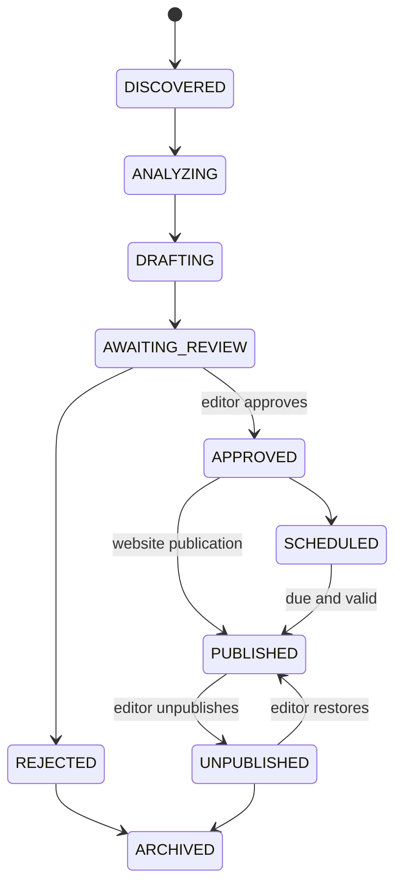

# API and workflow

`../contracts/openapi.yaml` describes every implemented Spring MVC route. A repository test
compares the static contract with controller annotations and the two Spring Security filter-chain
operations so route additions, removals, and HTTP-method changes cannot drift silently.

## Implemented HTTP surfaces

| Area | Routes |
|---|---|
| Identity | CSRF, registration, verification, password reset, current-profile read/update/delete/export, and session list/revocation under `/api/v1/auth` |
| Public articles | `GET /api/v1/articles?limit=`, `GET /api/v1/articles/{slug}` |
| Editor articles | `POST /api/v1/admin/articles`, `GET/PUT .../{id}`, `POST .../{id}/approve`, `publish`, `schedule`, `reject`, `unpublish`, `restore`, `archive` |
| Comments | Public listing; authenticated submit/edit/delete/report; moderation queues/history, user privileges, and global/article settings |
| Newsletter | Subscribe, confirm, unsubscribe, preferences, signed provider webhooks, and administrator delivery history |
| Search | Full-text search plus topic and tag facets/listings |
| X source admin | Account list/read/create/update/remove/monitoring/simulation, blocked accounts, and source-post compliance inspection/actions |
| Media | Article image-generation list/regeneration/approval and media-asset deletion |
| Operations | Summary, failed-event listing, replay request/read, and replay records |

`POST /api/v1/auth/login` and `POST /api/v1/auth/logout` are not controller methods:
Spring Security's filter chain provides them. They remain documented in OpenAPI with
`x-framework-provided: spring-security`, and the drift test checks their configured URLs.

Public article responses currently use bounded list responses rather than cursor pages.
Authentication uses server sessions with form login or HTTP Basic. `XSRF-TOKEN` plus the matching
`X-XSRF-TOKEN` header is required for unsafe requests by the current security configuration,
including anonymous newsletter mutations and provider webhooks. Roles used by controllers are
`EDITOR`, `MODERATOR`, and `ADMINISTRATOR`.

## Conventions

- JSON uses UTF-8, ISO 8601 timestamps, opaque UUIDs, and enum strings matching the implementation.
- `limit` defaults to 20; clients must treat server bounds and ordering as authoritative.
- Public cache policy is currently 30 seconds for article lists and 2 minutes for an article.
- Validation constraints in OpenAPI mirror controller records where known. API failures use RFC 9457 problem details with a trace identifier.
- Article edits require an `expectedVersion` optimistic-lock guard. Other mutations should gain request idempotency keys in a backward-compatible API revision.
- Never expose credentials, provider payloads, unrestricted X content, AI prompts, stack traces, or internal hostnames.

## Article lifecycle

| Transition/event | Guard |
|---|---|
| X post discovered → normalized | monitored account enabled; official API response authorized; post deduplicated |
| normalized source → story analysis | relevance/topic policy met; source not blocked |
| analysis → draft request/generated | typed schema valid; claims cite source IDs; safety/uncertainty recorded |
| generated draft → awaiting review | article and source citations persisted; image may complete asynchronously |
| awaiting review → approved | `EDITOR`/`ADMINISTRATOR`; human review evidence; current content frozen |
| approved/scheduled → published | publication policy satisfied; website operation idempotent |
| published → newsletter request | article is newsletter-eligible; campaign key deduplicated |
| published → unpublished/restored | authorized actor; audit/publication record written |

No lifecycle transition publishes to X.

## Planned administration surfaces

Not currently represented as implemented OpenAPI operations: AI request inspection, revision
comparison, newsletter campaign management, retention/deletion jobs, audit search, and provider
capability/configuration views. Introduce them only with authorization, pagination, idempotency,
audit, and contract tests.
