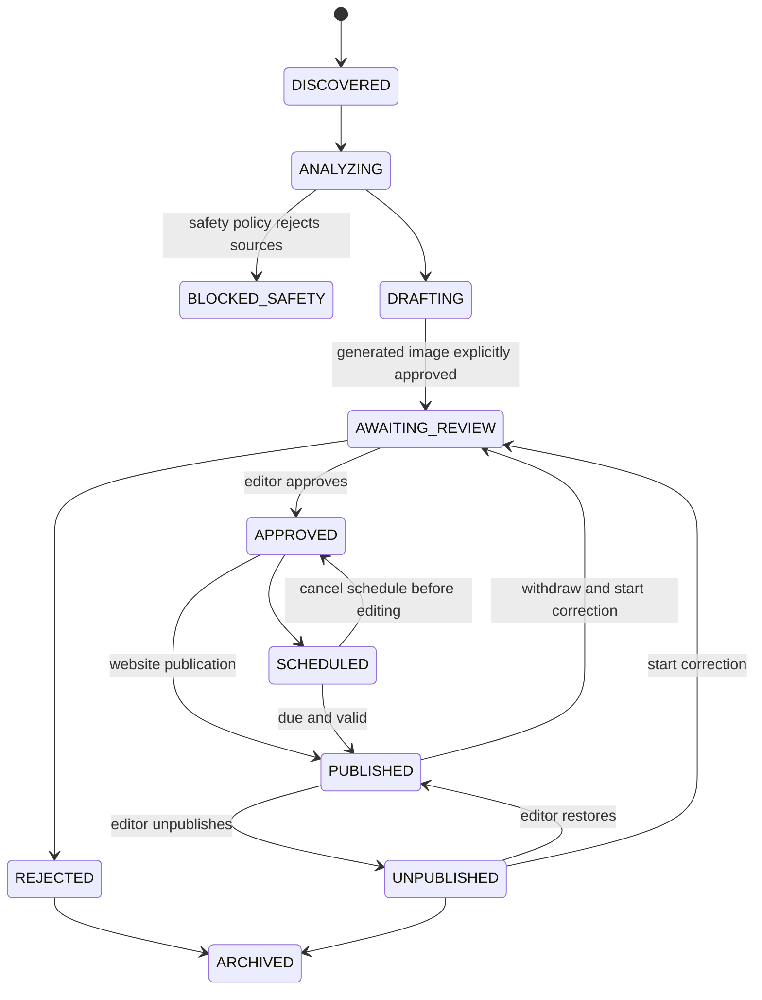

# API and workflow

`../contracts/openapi.yaml` records the implemented Spring MVC routes. A repository test
compares the static contract with controller annotations and the two Spring Security filter-chain
operations to detect route additions, removals, and HTTP-method changes. This is not a full
request/response payload or backward-compatibility check.
Controller discovery parses Java syntax, supports optional class mappings and qualified annotations,
and combines relative paths using Spring's path parser. Unsupported inheritance/mapping forms,
dynamic or multiple paths, malformed syntax and duplicate method/path pairs fail explicitly rather
than being silently skipped.

Current API presence does not imply a complete browser workflow or production qualification.
See the [completion matrix](completion-matrix.md), especially F05, P01-P06 and W04.

## Implemented HTTP surfaces

| Area | Routes |
|---|---|
| Identity | CSRF, registration, verification, password reset, current-profile read/update/delete/export, and session list/revocation under `/api/v1/auth` |
| Users and roles | Administrator-only paginated `/api/v1/admin/users`, account detail, and versioned role changes |
| Public articles | Legacy `GET /api/v1/articles?limit=`, paginated `/api/v1/articles/discovery`, article detail, related articles and selected illustration variants |
| Editor articles | `GET /api/v1/admin/articles?state=&page=&size=`, `POST /api/v1/admin/articles`, `GET/PUT .../{id}`, `POST .../{id}/approve`, `publish`, `schedule`, `reject`, `unpublish`, `restore`, `archive` |
| Editorial history / corrections | `GET .../articles/{id}/revisions?page=&size=`, `GET .../revisions/compare?from=&to=`, `POST .../articles/{id}/corrections` |
| Scheduling / policy | `GET /api/v1/admin/publication-schedules?status=&articleId=&page=&size=`, `PATCH .../{id}`, `POST .../{id}/cancel`, `GET /api/v1/admin/publication-policy` |
| Candidates / AI evidence | `GET /api/v1/admin/story-candidates?page=&size=`, `POST .../{id}/regenerate`, `GET /api/v1/admin/ai-requests?storyCandidateId=` |
| AI configuration | Administrator-only `/api/v1/admin/ai-configuration`, deployed provider catalog, immutable prompt versions and configuration history |
| Comments | Public listing; authenticated submit/edit/delete/report; moderation queues/history, user privileges, and global/article settings |
| Newsletter | Subscribe, confirm, unsubscribe, preferences, signed provider webhooks, and administrator delivery history |
| Search | Full-text search plus topic and tag facets/listings |
| X source admin | Account resolution/capabilities/list/read/create/update/remove/monitoring/simulation, blocked accounts, and source-post compliance inspection/actions |
| Media | Article image-generation list/regeneration/approval, explicit versioned fallback creation, authenticated generation content and media-asset deletion |
| Operations | Exact workflow counts, paged failures/replay history, dry-run/confirmation and replay records |
| Audit | Administrator-only `/api/v1/admin/audit-records` with action, actor, target and bounded time filters |

`POST /api/v1/auth/login` and `POST /api/v1/auth/logout` are not controller methods:
Spring Security's filter chain provides them. They remain documented in OpenAPI with
`x-framework-provided: spring-security`, and the drift test checks their configured URLs.

Public discovery uses `{items,page,size,total}`; the legacy bounded-list endpoint remains compatible.
Authentication uses server sessions with form login or HTTP Basic. `XSRF-TOKEN` plus the matching
`X-XSRF-TOKEN` header is required for unsafe requests by the current security configuration,
including anonymous browser confirmation/preference mutations. Exact `POST /api/v1/newsletter/unsubscribe`
is exempt for token-authorized RFC 8058 one-click requests; GET never withdraws consent.
The provider-webhook route is exempt from browser
CSRF because external providers cannot hold a browser token; production authenticates the raw body
with Resend's `svix-id`, `svix-timestamp`, and `svix-signature` headers and deduplicates the Svix
message ID. Roles used by controllers are `EDITOR`, `MODERATOR`, and `ADMINISTRATOR`.

## Conventions

- JSON uses UTF-8, ISO 8601 timestamps, opaque UUIDs, and enum strings matching the implementation.
- `limit` defaults to 20; clients must treat server bounds and ordering as authoritative.
- Public article/search/discovery responses are no-store so withdrawals do not wait for cache expiry.
- Validation constraints in OpenAPI mirror controller records where known. API failures use RFC 9457 problem details with a trace identifier.
- Article edits and correction starts require `expectedVersion`. Transition endpoints accept the
  reviewed version as an optional query for legacy compatibility; the editor UI always supplies it.
- Article, candidate regeneration, media and scheduling mutations accept an actor-scoped
  `Idempotency-Key`; retries retain the same payload, array order and expected version. Keys reused
  for different commands return 409. Role, AI-configuration, comment/moderation, newsletter-preference/
  reconciliation and replay controls also use durable receipts; their contracts specify required keys.
  Sending a key to an unrelated endpoint does not confer duplicate protection.
- The browser retains uncertain mutation keys after transport, server or response-decoding
  failures, without automatically retrying. An unchanged retry in that client uses the same key;
  completed actions use new keys. This bounded in-memory registry is cleared on login/logout or
  reload. Reconcile uncertain outcomes before restarting a session; no request bodies or
  authentication tokens are persisted in browser storage.
- Editorial queues use `{items,page,size,total}`, with `size` bounded to 1-100. Source selections
  must match authoritative stored identity, URL and publication time; source IDs are not fabricated.
- Candidate regeneration creates a new candidate and preserves the existing article. It is
  available for completed or safety-blocked candidates and rechecks source eligibility.
- Admin and image responses are `no-store`. Only the selected illustration on a published article
  is exposed publicly; the bucket remains private.
- Never expose credentials, unrestricted provider/source payloads, stack traces or internal hostnames.
  Versioned editorial guidance is available only through the authorized configuration workspace,
  not public article responses.

## Article lifecycle

| Transition/event | Guard |
|---|---|
| X post discovered → normalized | monitored account enabled; official API response authorized; post deduplicated |
| normalized source → story analysis | relevance/topic policy met; source active; related posts clustered by conversation or bounded text similarity |
| analysis → draft request/generated | strict schemas, authorized source/claim identities, quotation and safety checks; application-owned provenance is persisted; unsafe material terminates as `StoryAnalysisBlocked`; provider factual quality remains subject to human review |
| generated draft → awaiting review | article/source citations persisted; an image generation is selected only by explicit image approval |
| awaiting review → approved | editor approval, or configured non-production confidence/topic policy with no warnings |
| approved/scheduled → published | all sources remain active; scheduled publication retains the scheduling editor; website operation idempotent |
| published → newsletter request | article is newsletter-eligible; campaign key deduplicated |
| published → unpublished/restored | authorized actor; audit/publication record written |

No lifecycle transition publishes to X.

Production startup continues to require `HUMAN_REVIEW_ALWAYS`. The implemented
`CONFIDENCE_THRESHOLD`, `APPROVED_SOURCE_ONLY` and `TOPIC_RULES` modes support controlled
qualification environments; warnings, insufficient confidence and unapproved imagery deny
automation. Approved-source mode requires every source account in the configured nonempty
allowlist. Topic rules use `topic=threshold` comma-separated configuration.
`DRAFT_GENERATION_ONLY` suppresses automatic publication, not an editor's explicit approved
publication or scheduling command.

## Reader and administration boundaries

Registration returns only `202 {status:"verification_required"}`. Emailed verification and reset
links require explicit POST completion. Profile updates/deletion require the displayed account
version; deletion additionally requires `confirmation:"DELETE"`. Roles require the target email,
expected version and request key. Self-role edits, unverified promotion and removing the last active
administrator are rejected. Security stamps and indexed sessions invalidate old authorization.

Discussion reads are personalized and no-store, including effective global/article policy,
verified-account eligibility, suspension and the reader's own pending comments. Comment editing,
moderation, settings and privileges are versioned; absent settings/privileges expose version `-1`.
Moderators use queues/reports and a limited community directory, not the administrator user database.

Newsletter confirmation is POST with CSRF, not GET. Preference-link requests are enumeration-safe;
links expire after 30 minutes and are bound to current confirmed consent. Administration exposes
consent, campaigns, attempts, suppression and evidence-required reconciliation. Provider acceptance
is distinguished from signed delivery confirmation; reconciliation never silently resends mail.

AI administration selects a deployed provider/model and immutable prompt version. Operator
configuration controls provider capabilities, the model ceiling, network bindings and secret
references. Each generation captures its configuration; changing guidance cannot change hard safety
rules or publish an article. Image model/bindings remain operator-controlled.

Audit and replay workspaces are administrator-only. Replay confirmation binds a completed dry run
to its actor and exact eligible records for 15 minutes, rechecks eligibility and creates one durable
job. Health counts describe application workflow state, not proof of external-service connectivity.
Retention/deletion-job administration and production operational qualification remain open.

## Revisions, corrections and schedules

Article commands, views and full snapshots support nullable `content`:
`{"version":1,"blocks":[{"type":"paragraph","text":"Report"}]}`. Other supported types are
`heading` (fixed h2), `quote`, `unordered_list`/`ordered_list` (string `items`) and `link`
(`text` plus an absolute HTTP(S) `url` without credentials, whitespace or controls). Unknown
fields/types are rejected; unused known fields may be absent or null. Limits are 200 blocks,
100 items per list, 2048 URL characters and 100000 canonical body characters including separators.
Rendering treats all text literally, not as HTML.

When content is supplied it is authoritative, and `body` may be omitted. The server trims text/items
and derives `body`: blank lines between blocks, newlines between list items, and `text (url)` for
links. Legacy body-only requests remain supported. Absent live content is interpreted as paragraphs
without backfilling historical snapshots; malformed present content is not silently downgraded.

`GET /api/v1/admin/articles/{id}/revisions` pages immutable snapshots. The `compare` subroute takes
`from` and `to` revision numbers and returns both snapshots plus changed field names. Older or
source-redacted full snapshots are explicitly unavailable; only actually retained fields are shown.

`POST .../{id}/corrections {expectedVersion,note}` withdraws a published/unpublished canonical
article and starts a reviewed correction. Normal editing and renewed approval are required before
republishing. The original publication timestamp and URL remain; no additional newsletter is sent.

`GET /api/v1/admin/publication-schedules` accepts status, articleId, page and size.
`PATCH .../{id} {expectedVersion,publishAt}` changes the future time; `POST .../{id}/cancel
{expectedVersion}` cancels. Failed schedules show their retained error and responsible actor.
An approved-version change requires cancellation and renewed review, not an automatic retry.
Successful reschedule/cancel replays return the current schedule view rather than a frozen response.
Legacy rows without a captured article version require cancellation and explicit recreation.
`GET /api/v1/admin/publication-policy` reports the configured mode and its explicit automation limits.

## Explicit fallback imagery

`POST /api/v1/admin/articles/{id}/images/fallback {altText,reason,expectedVersion}` requires an
editor/administrator and an actor-scoped `Idempotency-Key`; it returns `202 {eventId}`. The command
locks the article and checks the reviewed version and editable state (`DRAFTING`,
`AWAITING_REVIEW` or `APPROVED`) before creating media. Stale versions return 409.

The original newspaper/geometric PNG has hero, thumbnail and social variants, no third-party assets,
and fixed `nsangusa-editorial / neutral-illustration-v1` provenance. The reason and rights statement
are audited. Creation requires subsequent explicit image approval and preserves any selected image.
No failed provider call silently selects this fallback. Approval records `generatedImage:false`;
legacy image approval events with the flag absent retain the prior generated-image interpretation.
