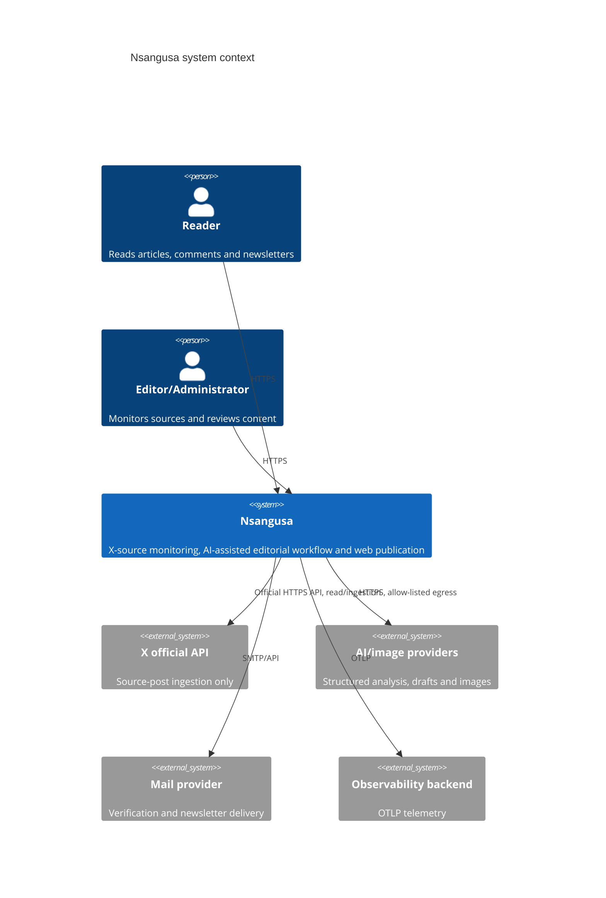
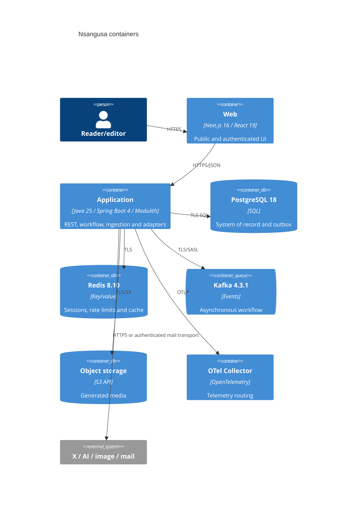
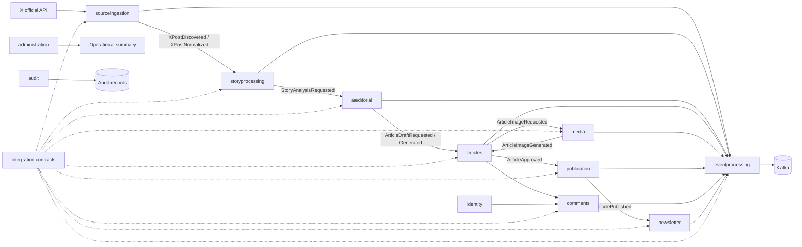

# Architecture and ownership

## System context

## Containers

## Module flow

## Responsibilities and table ownership

| Module | Responsibility | Owned tables |
|---|---|---|
| `identity` | Registration, credentials, profiles, roles, verification and sessions | `users`, `user_roles`, `external_identities`, `verification_tokens`; Redis session keys |
| `sourceingestion` | Monitored X accounts, official-API polling, discovery, normalization and source relationships | `monitored_x_accounts`, `blocked_source_accounts`, `source_posts`, `source_relationships` |
| `storyprocessing` | Candidate-story lifecycle and source grouping | `story_candidates` |
| `aieditorial` | Typed AI analysis/draft requests, results, confidence and provider metadata | `ai_requests`, `ai_results` |
| `articles` | Article aggregate, sources, revisions and editorial state | `articles`, `article_sources`, `article_revisions` |
| `media` | Generated image workflow and object metadata | `media_assets`, `image_generations` |
| `publication` | Website publication/unpublication/restore, schedules and evidence | `publication_records`, `scheduled_publications` |
| `comments` | Submission, thread reads, moderation and reports | `comments`, `comment_reports`, `moderation_actions` |
| `newsletter` | Double opt-in, consent, campaigns and delivery | `newsletter_subscriptions`, `consent_records`, `newsletter_campaigns`, `newsletter_deliveries` |
| `eventprocessing` | Transactional outbox, relay and consumer deduplication | `outbox_events`, `processed_events` |
| `integration` | Stable event envelope, payload records and topic mapping | No tables |
| `administration` | Operational/admin use-case endpoints; no domain ownership | No tables |
| `audit` | Security and domain audit evidence | `audit_records` |

Actual Modulith dependencies are declared in each module's `package-info.java`; `integration` has no dependencies, while workflow modules depend on `integration` and `eventprocessing`. `comments` additionally depends on `articles` and `identity`; `publication` additionally depends on `articles`.

`provider_webhooks` exists in the initial migration but has no confirmed owning implementation; assign it to a module before use rather than permitting shared writes.
