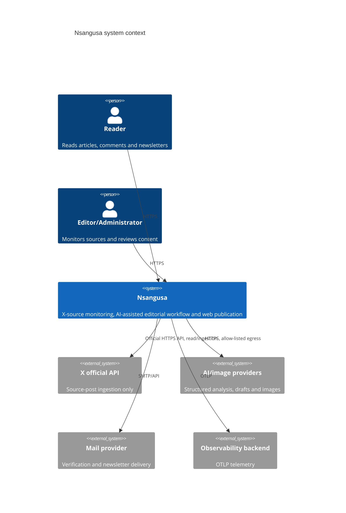
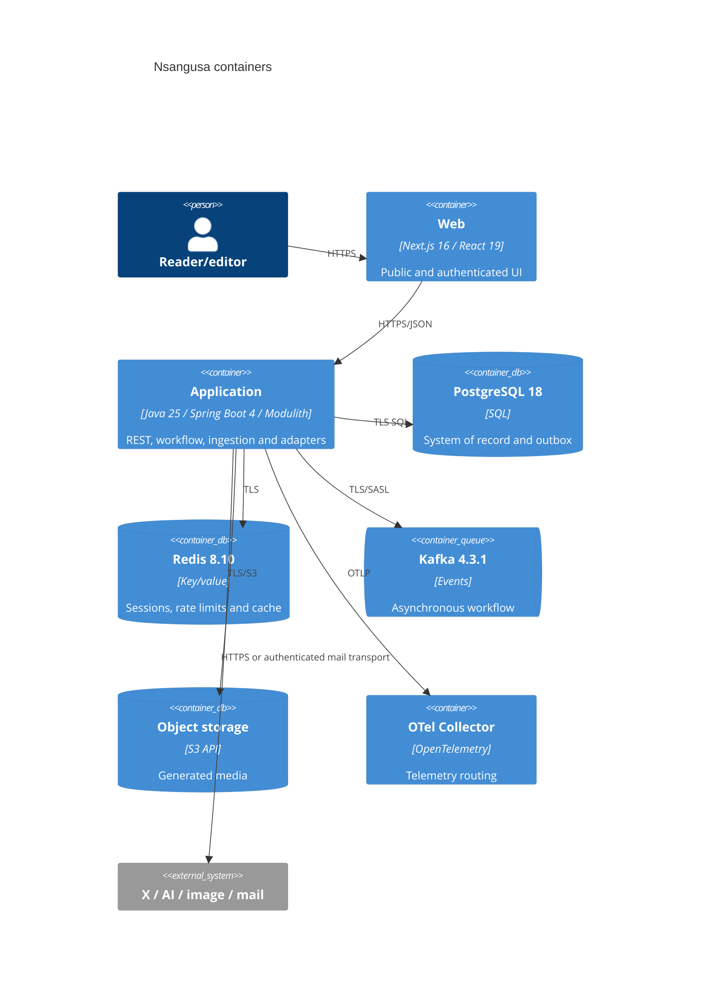
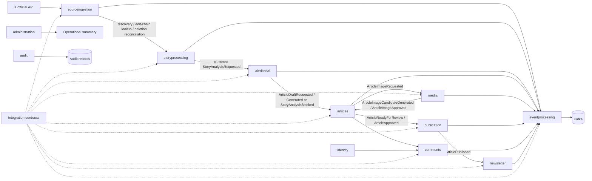

# Architecture and ownership

This document describes the architecture and intended ownership, not production qualification of
every illustrated flow or table-backed feature. AI results and their administrative inspection are
implemented; remaining capabilities and qualification are tracked in the
[completion matrix](completion-matrix.md).

## System context

## Containers

## Module flow

## Responsibilities and table ownership

| Module | Responsibility | Owned tables |
|---|---|---|
| `identity` | Registration, credentials, profiles, versioned role administration, verification and session revocation | `users`, `user_roles`, `external_identities`, `verification_tokens`, `identity_administration_guard`; indexed Redis session keys |
| `sourceingestion` | Monitored X accounts, official-API polling, discovery, normalization and source relationships | `monitored_x_accounts`, `blocked_source_accounts`, `source_posts`, `source_relationships` |
| `storyprocessing` | Time-bounded topic/conversation clustering and candidate lifecycle | `story_candidates`, `story_candidate_sources` |
| `aieditorial` | Typed AI requests/results, immutable prompt/configuration versions and generation provenance | `ai_requests`, `ai_results`, `ai_prompt_versions`, `ai_configuration_versions` |
| `articles` | Article aggregate, sources, revisions and editorial state | `articles`, `article_sources`, `article_revisions` |
| `media` | Generated image workflow and object metadata | `media_assets`, `image_generations` |
| `publication` | Website publication/unpublication/restore, schedules and evidence | `publication_records`, `scheduled_publications` |
| `comments` | Submission, thread reads, moderation and reports | `comments`, `comment_reports`, `moderation_actions` |
| `newsletter` | Double opt-in, consent, account linking, preferences, campaigns, delivery evidence and reconciliation | `newsletter_subscriptions`, `consent_records`, `newsletter_campaigns`, `newsletter_deliveries`, `newsletter_preference_links`, `newsletter_delivery_attempts` |
| `eventprocessing` | Outbox/relay, deduplication, durable command receipts, failure inventory and confirmed replay | `outbox_events`, `processed_events`, `request_idempotency`, `failed_events`, `event_replay_requests`, `event_replay_records` |
| `integration` | Stable event envelope, payload records and topic mapping | No tables |
| `administration` | Operational/admin use-case endpoints; no domain ownership | No tables |
| `audit` | Security and domain audit evidence | `audit_records` |
| `search` | Public full-text search and topic/tag projections | `article_search_documents` |

Actual Modulith dependencies are declared in each module's `package-info.java`; `integration` has no
dependencies, while workflow modules depend on `integration` and `eventprocessing`. `articles`
additionally uses the public `sourceingestion` eligibility service for defense-in-depth publication
checks; `comments` depends on `articles` and `identity`; `publication` depends on `articles`.

Publication visibility uses a synchronous internal `ArticleVisibilityChanged` event and the
public search service in the article transaction. Durable Kafka events remain available for other
consumers and reconciliation; delayed search events reconcile the current locked article state.
Public article/search/feed/sitemap responses use no-store. Redis is not authoritative for
publication visibility, and production capacity/CDN cutover remain qualification gates.

`provider_webhooks` is owned by `newsletter`.

Identity accesses linked newsletter preferences only through public newsletter services, never
newsletter SQL/repositories. Comments uses the identity public directory/display-name boundary;
moderators receive no general user email/role inventory. Role changes persist security stamps,
then revoke indexed sessions after commit; request-time authorization rejects obsolete stamps.

AI administration can select only deployed capabilities/models and stored prompt versions.
Provider URLs, credentials, the deployment model ceiling and image configuration remain operator
controls. Audit owns bounded evidence queries; administration composes public audit/workflow
services without accessing their repositories.

Spring Modulith enforces module boundaries and provides runtime observability. Durable transport
uses the application's PostgreSQL outbox/inbox and Spring Kafka, not Modulith's separate JPA event
publication registry or Kafka externalization. Unused persistence/externalization starters are
excluded so there is one explicit durability mechanism and no unmigrated second registry.

Kafka transports validated JSON envelope strings. The event/provider boundary retains an explicit
Jackson 2 mapper; Spring Boot 4 MVC uses its Jackson 3 mapper. API responses use ordinary DTOs,
records and maps rather than exposing Jackson 2 tree objects through Jackson 3 serialization.
