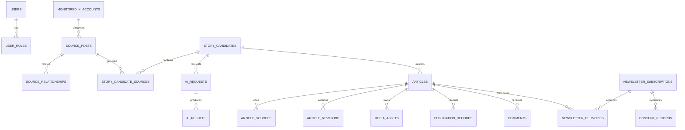

# Data model and retention

The logical model and retention rules include target behavior. A migrated table is not evidence
of a completed write/read/cleanup workflow. Full new revision snapshots, AI-result/provenance
persistence and controlled media delivery are implemented; cross-store retention remains open.
See F04, A03, P03, M02 and Q03 in
the [completion matrix](completion-matrix.md).

## Logical model

## Storage rules

- The migration uses the implemented names in `V1__initial_schema.sql`; documentation must not invent replacement table names.
- PostgreSQL schemas use `timestamptz`, UUIDs, bounded provider identifiers, `jsonb` fields for
  structured AI results/audit metadata, and optimistic versions on mutable aggregates.
- `V8__editorial_provenance.sql` persists AI attempts/results, provider/model/prompt/time metadata
  and token reservations. Failure evidence survives workflow rollback. Source invalidation
  redacts retained result content while preserving non-content request provenance.
- `V9__media_delivery.sql` associates each stored hero/thumbnail/social asset with its exact image
  generation and variant. `V10__editorial_workspace.sql` links articles to candidates and snapshots
  the original full generated draft.
- `V11__complete_article_revisions.sql` stores full new editorial snapshots, including sources,
  metadata, image selections, approval and correction provenance. Historical rows without this
  evidence remain explicitly incomplete. Source invalidation clears retained full snapshots as
  well as original AI evidence; comparisons never reconstruct redacted content.
- `V12__publication_controls.sql` stores optimistic schedule versions, the captured article
  version, responsible actors, timestamps and failure/attempt metadata. One scheduled/failed row
  may remain active per article. Historical unversioned nonterminal rows become failed, including
  earlier `pending` rows; their original status is retained in the diagnostic.
- `V13__request_idempotency.sql` stores actor/key-scoped hashes, command identity and successful
  result identifiers, atomically with domain/outbox effects. It stores no request content.
  A transaction-scoped PostgreSQL advisory lock serializes concurrent matching requests.
- `V14__identity_administration.sql` stores authentication-valid-after stamps, profile update
  timestamps, locally managed role provenance and the serialized administration guard. Active
  sessions are indexed in Redis; durable account stamps remain authoritative for revocation.
- `V16__newsletter_management.sql` stores expiring consent-bound preference links, delivery
  attempts, confirmed-delivery timestamps and evidence/actor/time for terminal reconciliation.
  SMTP acceptance is not promoted to confirmed delivery without provider evidence.
- `V17__ai_administration.sql` stores immutable `ai_prompt_versions` and
  `ai_configuration_versions`. AI requests capture the configuration, requested model, guidance
  and nonsecret reference used by the actual provider request.
- `V18__administration_queries.sql` binds each dry-run preview to at most one confirmed replay,
  stores the next batch eligibility time shared by replicas, and indexes audit/replay inventory.
  Migration numbers 15 and 19 were reserved but unused; no empty migrations are introduced.
- `V20__structured_article_content.sql` adds nullable version-one article `content` JSONB.
  New edits persist validated blocks plus their canonical plain body; snapshots retain both.
  Legacy bodies are interpreted as paragraphs on read, without rewriting historical revisions.
  Existing full-snapshot source redaction also removes nested structured content. Live article
  derivatives remain subject to the same withdrawal and outstanding cross-store retention rules
  as their pre-existing plain bodies.
- `V21__fallback_image_provenance.sql` keeps synchronous image selection/version guards while
  recording `generated_image=false` only for the exact original neutral-fallback provider/model.
  Other and legacy generations retain their existing interpretation. Unapproved fallback variants
  remain private candidates and do not replace the selected generation.
- `permitted_text` is the X text the account and applicable terms permit the product to retain. Raw/unneeded provider payloads are not persisted.
- Source rows retain the stable edit-chain identifier, current post identifier, conversation
  identifier, and last official-API observation/check timestamps. Explicit not-found responses
  tombstone the source; new edit-chain versions suppress dependent workflow until review.
- Story candidates collect bounded source memberships during a configurable quiet period and retain
  deterministic cluster terms for reproducible grouping. Regeneration creates a new candidate
  with the current eligible sources; memberships are unique per candidate/source pair, not globally.
- Article source citations preserve source-post/account/post identifiers, URL, and publication time.
- Provider tokens remain in secrets, never domain tables. AI provider/model/prompt version and token counts are operational provenance, not credentials.
- Media objects are referenced by object key and integrity metadata. Editor previews and selected
  published images use controlled backend reads from private storage. CDN, encrypted storage and
  production access/performance qualification remain operational gates.
- Articles distinguish pending and approved image generations. Regeneration cannot replace the
  selected public image until an editor explicitly approves that generation. The database
  compatibility trigger rejects selection for rejected/archived articles and transitions legacy
  approvals out of `DRAFTING`; current writers complete the transition through
  `ArticleImageApproved`. A database state guard also prevents mixed-version writers from
  approving, scheduling, or publishing while image approval is still required.
- Newsletter deliveries persist a stable provider idempotency key plus whether a provider-aware
  sender applied it. Retries reuse confirmed keys; legacy attempts without that marker require
  reconciliation instead of an automatic resend.
- `outbox_events` is written in the same transaction as domain state. `processed_events(event_id, consumer_name)` deduplicates consumers.
- Redis is disposable except active sessions, which fail closed if their state cannot be verified.

## Default retention requiring approval

| Data | Proposed default | Disposal |
|---|---:|---|
| X source text and relationships | Shortest period permitted and operationally necessary; review at 30 days | Delete/anonymize content and derived caches; retain minimal non-content audit |
| Rejected/abandoned candidates and AI results | 30 days | Hard delete content; retain aggregate metrics |
| AI prompts/results for active articles | Until editorial completion + 30 days | Delete prompt/result content; retain provider/model/timing |
| Published articles/revisions/source citations | Product/legal lifetime | Unpublish, archive, then policy disposal |
| Generated media | Article lifetime + 30 days | Delete object and metadata/tombstone |
| Rejected/spam/deleted comments | 30 days, unless abuse/legal hold | Hard delete or anonymize |
| Unconfirmed newsletter subscriptions | 7 days | Delete address and tokens |
| Unsubscribed subscriber data | 30 days; consent evidence as legally required | Delete address/tokens; retain minimal consent evidence |
| Outbox published rows | 7 days | Partition/batch delete |
| Processed-event dedupe rows | Maximum replay window + 7 days | Partition/batch delete |
| Editorial request receipts | At least the approved client replay window | No automatic deletion until a replay/retention policy is approved |
| Application logs | 30 days | Backend lifecycle policy |
| Audit records | 365 days or approved policy | Restricted lifecycle deletion |
| Backups | 35 days | Automated expiry and key destruction |

X deletion/compliance requests have local source and derivative-suppression controls, but the
complete cross-store/provider cleanup and backup-restoration process remains to be implemented and
qualified under X04/Q03. A legal hold must be scoped, authorized, audited, reviewed, and released
explicitly.
