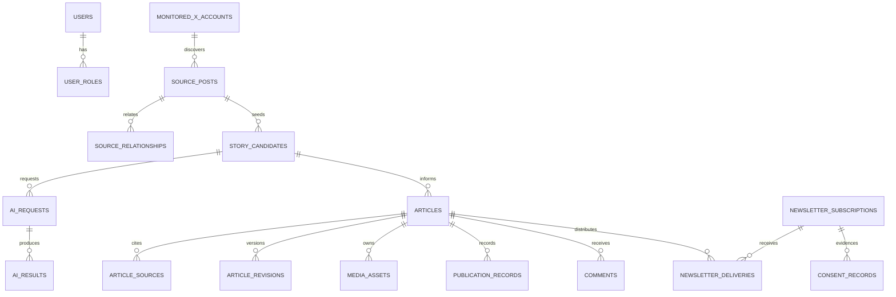

# Data model and retention

## Logical model

## Storage rules

- The migration uses the implemented names in `V1__initial_schema.sql`; documentation must not invent replacement table names.
- PostgreSQL stores timestamps as `timestamptz`, identifiers as UUID, provider-specific identifiers as bounded strings, structured AI results/audit metadata as `jsonb`, and optimistic versions where aggregates mutate.
- `permitted_text` is the X text the account and applicable terms permit the product to retain. Raw/unneeded provider payloads are not persisted.
- Article source citations preserve source-post/account/post identifiers, URL, and publication time.
- Provider tokens remain in secrets, never domain tables. AI provider/model/prompt version and token counts are operational provenance, not credentials.
- Media objects are referenced by object key and integrity metadata; storage is private and served through controlled application/CDN paths.
- `outbox_events` is written in the same transaction as domain state. `processed_events(event_id, consumer_name)` deduplicates consumers.
- Redis is disposable except active sessions, which fail closed if their state cannot be verified.

## Default retention requiring approval

| Data | Proposed default | Disposal |
|---|---:|---|
| X source text and relationships | Shortest period permitted and operationally necessary; review at 30 days | Delete/anonymize content and derived caches; retain minimal non-content audit |
| Rejected/abandoned candidates and AI results | 30 days | Hard delete content; retain aggregate metrics |
| AI prompts/results for active articles | Until editorial completion + 30 days | Delete prompt/result content; retain provider/model/timing |
| Published articles/revisions/source citations | Product/legal lifetime | Unpublish, archive, then policy disposal |
| Generated media | Article lifetime + 30 days | Delete object and metadata/tombstone |
| Rejected/spam/deleted comments | 30 days, unless abuse/legal hold | Hard delete or anonymize |
| Unconfirmed newsletter subscriptions | 7 days | Delete address and tokens |
| Unsubscribed subscriber data | 30 days; consent evidence as legally required | Delete address/tokens; retain minimal consent evidence |
| Outbox published rows | 7 days | Partition/batch delete |
| Processed-event dedupe rows | Maximum replay window + 7 days | Partition/batch delete |
| Application logs | 30 days | Backend lifecycle policy |
| Audit records | 365 days or approved policy | Restricted lifecycle deletion |
| Backups | 35 days | Automated expiry and key destruction |

X deletion/compliance requests trigger source, candidate, AI-derived, cache, search, article-citation, and backup-restoration controls where applicable. A legal hold must be scoped, authorized, audited, reviewed, and released explicitly.

